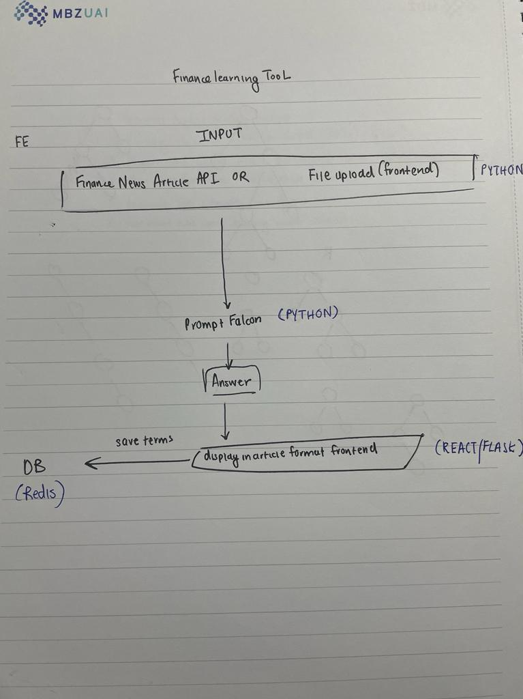

# Learning Text Summarizor Design Document

<!-- #### Table of Contents
##### Introduction
1.1 Purpose
1.2 Scope
1.3 Document Conventions
1.4 References

##### Architectural Overview
2.1 System Architecture
2.2 Data Flow Diagram
2.3 Components and Modules
2.4 Dependencies

##### Design Considerations
3.1 Design Goals and Objectives
3.2 Assumptions and Constraints
3.3 Risks and Mitigations

##### Data Design
4.1 Data Models
4.2 Database Schema
4.3 Data Flow

##### Application Design
5.1 User Interface Design
5.2 Functionality Overview
5.3 Class Diagrams
5.4 Sequence Diagrams
5.5 API Specification (if applicable)

##### Security
6.1 Authentication and Authorization
6.2 Data Encryption
6.3 Security Protocols

##### Performance
7.1 Performance Goals
7.2 Scalability
7.3 Load Testing Strategy

##### Testing Strategy
8.1 Unit Testing
8.2 Integration Testing
8.3 System Testing
8.4 User Acceptance Testing
8.5 Test Data and Environments

##### Deployment
9.1 Deployment Architecture
9.2 Deployment Process
9.3 Configuration Management

##### Maintenance and Support
10.1 Release Management
10.2 Support and Maintenance Plans

##### Documentation
11.1 User Documentation
11.2 Developer Documentation

##### Appendices
12.1 Glossary
12.2 Acronyms
12.3 Version History -->

## Introduction
### 1.1 Purpose
<!-- Describe the purpose of this document, including the goals and objectives it aims to achieve. -->
The goal of this document is to outline the design considerations and implementation progress of the the end-to-end text-summarizor project. Through this document, readers should have a detailed idea of the purpose of this project as well as the steps/iterations necesary to understand how the application works. The overall objective of this project is allow myself to become more financially literate while reducing the amount of time needed to do so. 

### 1.2 Scope
<!-- Define the scope of the software project, what it will accomplish, and any limitations or boundaries. -->
The scope of the project includes an end-to-end application that summarizes financial articles for to read while including vocabulary terms stored in a database for me to learn. The project will allow me to learn efficiently while being up-to-date on the daily financial news providing me with a better idea of what's happening globally for me to make better financial decisions. 

### 1.3 Document Conventions
Explain any conventions used throughout the document, such as terminology, notation, or formatting.

<!-- 
### 1.4 References
List any external references, documents, or standards that were used in the development of this design document. -->

### 2. Architectural Overview
The architecture of the application is as follows:

A python backend will be responsible for making API calls to the Newsapi.ai REST API for financial articles with a specified filter. The backend will clean and prase the data fetched from Newsapi.ai and pass it onto a LLM with a specified prompt suited for text summarization and extract words that can help improve user's financial literacy. Users will have the choice to select words they are not familiar with which is then passed onto a redis database. The frontend will also query the database to display a total list of words and associated definitions users have stored. 

2.2 Data Flow Diagram
Illustrate the flow of data within the system, highlighting key data processes and data sources.
Initially, the backend makes an API call to Newsapi.ai REST API for financial articles with specified keywords. Upon a successful API get request, the backend parses the data to separate each response into a list where each element holds a article json. This list is then passed onto the front end via the /load_article API endpoint. The frontend accesses the /load_article endpoint to display each article and the associated vocabulary in a webpage. Users then have the option to store new vocabulary terms they are not familiar. This action sends a POST request of the vocabulary term and the associated definition via the /post_vocab/ endpoint and stores the data into a redis database for retrieval. On the frontend, users will then have the ability to retreive the vocabulary definitions from the backend and database. 

2.4 Dependencies
Identify any external systems, libraries, or APIs that the software relies on.
This system uses a ReactJS frontend and a Python backend. For creating API endpoints on the server side, the Fastapi library is used over other options to make the process of creating APIs simple. Other Python libraries used to manipulate and parse data include: json, requests. The system uses a Redis database which stores the vocabulary term and associated definition. 

3.Design Considerations
Discuss the design goals, constraints, and risks associated with the project.

3.1 Design Goals and Objectives
Outline the key design objectives that the software should meet.

3.2 Assumptions and Constraints
List any assumptions made during the design process and any constraints that impact the design.

4. Data Design
Detail the design of data structures and database schema.
When the 

4.1 Data Models
Explain the data models used in the system, such as entity-relationship diagrams or data flow diagrams.

4.2 Database Schema
Provide a schema design for the database, including tables, relationships, and indexes.

4.3 Data Flow
Illustrate how data flows through the system, from input to storage and retrieval.

<!-- 
2.1 System Architecture
Describe the overall architecture of the system, including the major components and their interactions.

2.2 Data Flow Diagram
Illustrate the flow of data within the system, highlighting key data processes and data sources.

2.3 Components and Modules
List and describe the major components and modules within the system.

2.4 Dependencies
Identify any external systems, libraries, or APIs that the software relies on.

3. Design Considerations
Discuss the design goals, constraints, and risks associated with the project.

3.1 Design Goals and Objectives
Outline the key design objectives that the software should meet.

3.2 Assumptions and Constraints
List any assumptions made during the design process and any constraints that impact the design.

3.3 Risks and Mitigations
Identify potential risks to the project and the strategies in place to mitigate them.

4. Data Design
Detail the design of data structures and database schema.

4.1 Data Models
Explain the data models used in the system, such as entity-relationship diagrams or data flow diagrams.

4.2 Database Schema
Provide a schema design for the database, including tables, relationships, and indexes.

4.3 Data Flow
Illustrate how data flows through the system, from input to storage and retrieval.

5. Application Design
Describe the design of the software application itself.

5.1 User Interface Design
Provide an overview of the user interface, including wireframes or mockups if available.

5.2 Functionality Overview
Outline the major functionalities and features of the software.

5.3 Class Diagrams
Present class diagrams or object-oriented design details.

5.4 Sequence Diagrams
Show sequence diagrams to illustrate the interactions between components.

5.5 API Specification (if applicable)
If the system exposes APIs, document their specifications.

6. Security
Explain the security measures and considerations within the software.

6.1 Authentication and Authorization
Describe how users are authenticated and authorized to access the system.

6.2 Data Encryption
Explain how sensitive data is encrypted, if applicable.

6.3 Security Protocols
Detail any security protocols or standards that the software adheres to.

7. Performance
Discuss the performance requirements and strategies.

7.1 Performance Goals
State the performance goals that the software should meet.

7.2 Scalability
Explain how the system can be scaled to accommodate growing demands.

7.3 Load Testing Strategy
Outline the strategy for load testing to validate system performance.

8. Testing Strategy
Describe the testing approach for the software.

8.1 Unit Testing
Explain the unit testing strategy, including tools and methodologies.

8.2 Integration Testing
Detail how components are integrated and tested together.

8.3 System Testing
Explain the overall system testing approach.

8.4 User Acceptance Testing
Discuss the plan for user acceptance testing (UAT) by stakeholders.

8.5 Test Data and Environments
Describe the test data and testing environments used.

9. Deployment
Discuss the deployment strategy and architecture.

9.1 Deployment Architecture
Detail the deployment architecture, including server configurations.

9.2 Deployment Process
Explain how the software will be deployed to different environments (e.g., development, staging, production).

9.3 Configuration Management
Describe how configuration settings are managed and versioned.

10. Maintenance and Support
Explain the plans for ongoing maintenance and support.

10.1 Release Management
Detail how new releases and updates will be managed.

10.2 Support and Maintenance Plans
Outline the support and maintenance procedures for the software.

11. Documentation
Explain the documentation strategy for both users and developers.

11.1 User Documentation
Discuss user manuals, guides, or help resources.

11.2 Developer Documentation
Explain how developers can access technical documentation for the system.

12. Appendices
Include any additional information that supports the design document.

12.1 Glossary
Provide a glossary of terms and acronyms used in the

 -->
